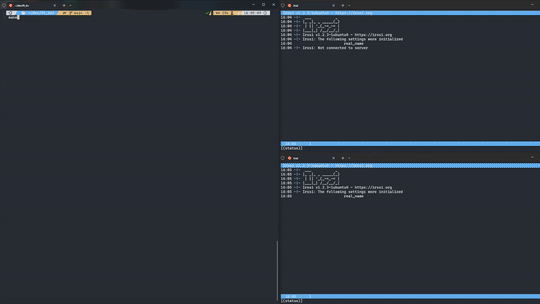

# 🌐 ft_irc – Internet Relay Chat

A custom **IRC (Internet Relay Chat) server** developed in C++98, offering real-time, text-based communication via channels and private messages. This project is perfect for exploring **network protocols**, **non-blocking I/O**, and the basics of multi-client server design in C++.

## Example


---

## 📖 Table of Contents

1. [About the Project 🚀](#-about-the-project)
2. [Features ✨](#-features)
3. [Prerequisites 📋](#-prerequisites)
4. [Installation & Setup 💻](#-installation--setup)
5. [Usage 🎮](#-usage)
6. [Learning Outcomes 📚](#-learning-outcomes)
7. [License ⚖️](#-license)

---

## 🚀 About the Project

This project recreates the core functionality of an **IRC server**. Users can **authenticate**, **choose a nickname** and **username**, **join channels**, and **exchange messages**. The server handles multiple simultaneous connections and relays messages in real time, demonstrating how **non-blocking network operations** work in C++.

---

## ✨ Features

- **Multi-Client Support:** Accepts multiple concurrent connections without blocking.  
- **Channel System:** Users can join channels, exchange public messages, and manage topics.  
- **Private Messaging:** Supports **PRIVMSG** for direct communication between two users.  
- **Operator Commands:** Enable channel operators to **KICK**, **INVITE**, and set channel **MODE** (e.g., invite-only, topic-restricted, user limits).  
- **Custom Authentication:** Requires a valid password to connect, ensuring only authorized clients access the server.  
- **Non-Blocking I/O:** Manages sockets using `poll()` (or equivalent) for efficient event handling.

---

## 📋 Prerequisites

- **C++98 Compatible Compiler**  
- **Make** (to build the project)  
- **No External Libraries** (everything done with standard libraries and system calls)

Make sure you have these in place before compiling the project.

---

## 💻 Installation & Setup

1. **Clone the Repository:**
   ```bash
   git clone https://github.com/mowhry/ft_irc.git
   cd ft_irc
2. **Usage:**
   Once the server is compiled, you can run it with:
   ```bash
   make
3. **(Optional) Adjust Configurations:**
    If you have a config file or want to tweak the default port/password, you can edit a config file or pass arguments at runtime.
## 🎮 Usage

Once the server is compiled, you can run it with:
```bash
./ircserv <port> <password>
```
**Example Execution:**
```bash
./ircserv 7776 pass
```
## 📚 Learning Outcomes
By developing this project, I was able to:
- **Understand Network Protocols:** Gain familiarity with the socket API, event polling, and TCP communication.
- **Implement Non-Blocking I/O:** Use poll() (or an equivalent) to manage multiple connections simultaneously.
- **Handle IRC Mechanics:** Explore IRC-specific commands (JOIN, PRIVMSG, MODE, etc.) and server-client messaging flows.
- **Enhance C++ Proficiency:** Write structured, maintainable code while respecting C++ standards.
## ⚖️ License
This project is licensed under the MIT License. You are free to use, modify, and distribute it under the terms of the license.
